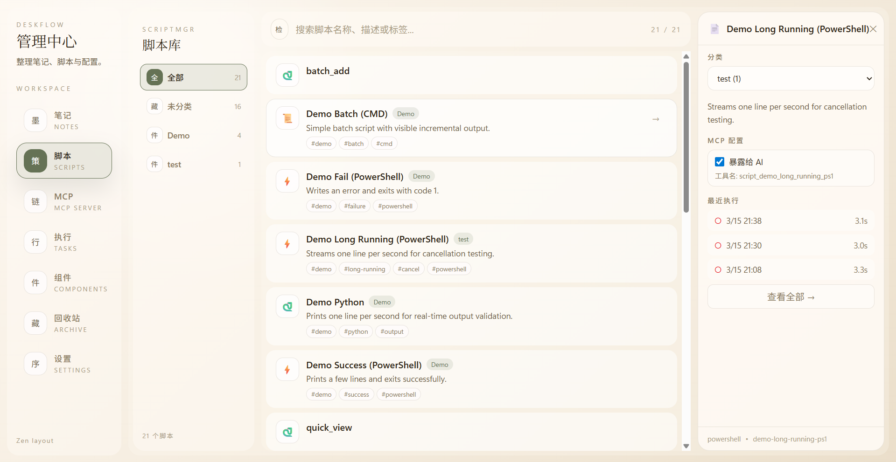

# EasyFlowHub

> 桌面效率工具 - 快速笔记 + 待办管理 + 脚本执行

基于 React、TypeScript、Vite、Tailwind CSS、Tauri、Rust 技术栈的桌面效率工具。

## 界面预览

| 快速笔记 | 笔记管理 |
|:---:|:---:|
|  |  |

| 待办卡片 | 脚本管理 |
|:---:|:---:|
|  |  |

| 设置面板 |
|:---:|
|  |

## 功能特性

### 快速笔记
- Markdown 编辑器，支持实时预览
- 全局快捷键 (Ctrl+Alt+N) 快速捕获
- 自动保存 + 标签管理
- 桌面悬浮窗口，支持透明度调节

### 待办管理
- 笔记内嵌 checkbox 语法 (`- [ ]` / `- [x]`)
- 全局待办聚合面板
- 桌面悬浮待办卡片，支持固定到桌面底层
- 已完成项保留期（防误触）

### 脚本管理
- 本地脚本发现与执行
- 执行记录与时间线

### 其他
- 模块化架构，可按需启用/禁用
- 回收站与数据恢复
- 键盘快捷键自定义
- 开机自启动（设置 > 通用）

## 技术栈

| 层 | 技术 |
|---|---|
| 前端 | React 19, TypeScript, Vite, Tailwind CSS |
| 桌面 | Tauri 2, Rust |
| 存储 | SQLite (rusqlite) |
| 平台 | Windows |

## 开发

```bash
# 安装依赖
cd easyflowhub-app
bun install

# 启动开发
bun tauri dev

# 构建
bun tauri build
```

## 快捷键

| 快捷键 | 功能 |
|--------|------|
| Ctrl+Alt+N | 新建快速笔记 |
| Ctrl+Alt+M | 显示/隐藏管理窗口 |
| Ctrl+Alt+D | 关闭所有快速笔记 |
| Ctrl+Alt+H | 隐藏/显示所有快速笔记 |

## 项目结构

```
easyflowhub/
├── easyflowhub-app/           # Tauri 主应用
│   ├── src/                   # React 前端
│   │   ├── components/        # UI 组件
│   │   ├── hooks/             # React Hooks
│   │   ├── lib/               # 工具函数
│   │   ├── modules/           # 功能模块
│   │   └── types/             # TypeScript 类型
│   └── src-tauri/             # Rust 后端
│       └── src/
│           ├── lib.rs          # 主入口
│           ├── notes.rs        # 笔记模块
│           ├── settings.rs     # 设置模块
│           ├── scriptmgr.rs    # 脚本管理
│           └── mcp_server.rs   # MCP 服务器
├── docs/                      # 文档
└── image/                     # 截图资源
```

## License

MIT
