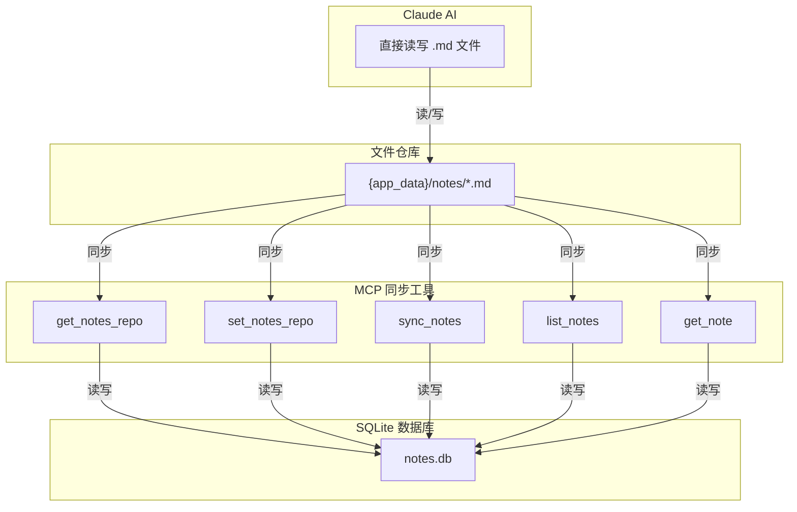
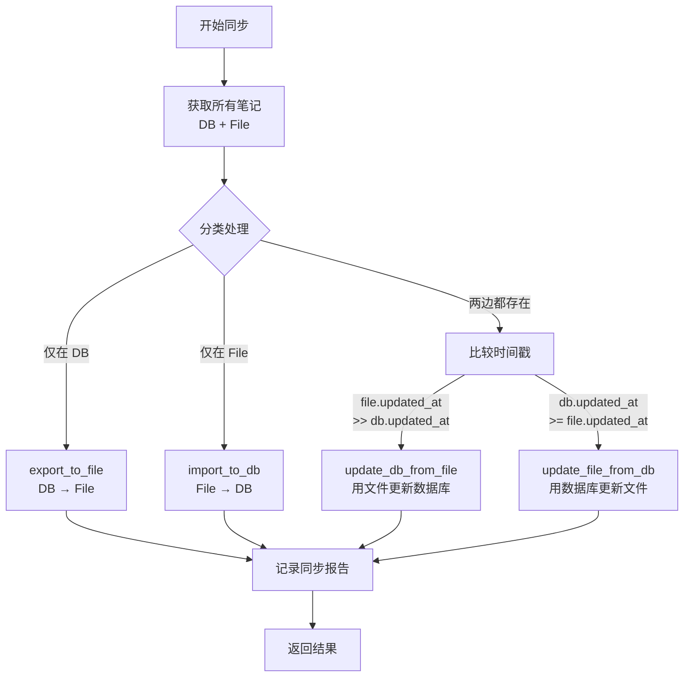

# Notes MCP Sync 架构设计

> **日期**: 2026-03-19
> **状态**: 已批准
> **关联**: scriptmgr-go MCP, DeskFlow 笔记系统

## 概述

实现 MCP 工具，使 AI 能够通过文件系统管理 DeskFlow 笔记。采用「文件仓库」模式：Claude 直接读写 Markdown 文件，MCP 负责同步数据库和文件。

## 架构图



## MCP 工具

### 1. get_notes_repo
获取笔记仓库路径。

| 字段 | 类型 | 说明 |
|------|------|------|
| 输入 | 无 | |
| path | string | 笔记仓库绝对路径 |
| exists | boolean | 路径是否存在 |

### 2. set_notes_repo
设置笔记仓库路径（自定义位置）。

| 字段 | 类型 | 说明 |
|------|------|------|
| 输入 | `{ path: string }` | 目标路径 |
| success | boolean | 设置是否成功 |
| path | string | 最终路径 |

### 3. sync_notes
同步数据库和文件仓库。

| 字段 | 类型 | 说明 |
|------|------|------|
| 输入 | `{ direction: "bidirectional" \| "db_to_file" \| "file_to_db" }` | 同步方向 |
| success | boolean | 同步是否成功 |
| report | SyncReport | 同步报告 |

**SyncReport 结构**:
```json
{
  "exported": 5,
  "imported": 2,
  "updated": 3,
  "skipped": 10,
  "errors": []
}
```

### 4. list_notes
列出所有笔记（从文件仓库读取，支持搜索）。

| 字段 | 类型 | 说明 |
|------|------|------|
| 输入 | `{ search?: string }` | 可选的关键词搜索 |
| 返回 | Note[] | 笔记列表 |

### 5. get_note
获取单个笔记内容。

| 字段 | 类型 | 说明 |
|------|------|------|
| 输入 | `{ note_id: string }` | 笔记 UUID |
| 返回 | Note | 笔记详情 |

## 文件格式

### Markdown + YAML Frontmatter

```markdown
---
id: 550e8400-e29b-41d4-a716-446655440000
title: 笔记标题
tags: [tag1, tag2]
created_at: 2026-03-19T10:00:00Z
updated_at: 2026-03-19T12:00:00Z
is_pinned: false
is_trashed: false
---

# 笔记标题

笔记内容正文，支持 Markdown 格式。
```

### 文件命名规则

- 格式: `{id}.md`
- 示例: `550e8400-e29b-41d4-a716-446655440000.md`

## 同步逻辑

### 优先级规则: 时间戳优先



### 时间戳冲突处理

当 `file.updated_at == db.updated_at` 时，视为无变化，跳过同步。

## 数据库 Schema

### notes 表

| 字段 | 类型 | 说明 |
|------|------|------|
| id | TEXT PRIMARY KEY | UUID |
| title | TEXT | 标题 |
| content | TEXT | Markdown 内容 |
| tags | TEXT | 逗号分隔的标签 |
| is_pinned | INTEGER | 是否置顶 (0/1) |
| is_trashed | INTEGER | 是否在回收站 (0/1) |
| created_at | TEXT | 创建时间 ISO8601 |
| updated_at | TEXT | 更新时间 ISO8601 |

## 配置管理

- **默认路径**: `{app_data}/notes/`
- **配置存储**: `{app_data}/mcp_config.json`

```json
{
  "notes_repo": "C:\\Users\\...\\DeskFlow\\notes",
  "last_sync": "2026-03-19T12:00:00Z"
}
```

## 错误处理策略

1. **原子性**: 单个笔记同步失败不影响其他笔记
2. **记录**: 错误写入 report.errors，继续同步
3. **回滚**: 不支持自动回滚，需手动处理
4. **日志**: 详细记录同步过程便于排查

## 实施注意事项

1. 直接访问 DeskFlow 的 SQLite 数据库 (`notes.db`)
2. 文件名使用 `{id}.md` 格式，避免文件名冲突
3. 同步前检查文件和数据库的时间戳
4. 错误处理：记录错误但继续同步其他笔记
5. 建议: 首次使用前先执行一次全量同步
6. 建议: 定期执行 sync_notes 保持一致性
