# Deskflow UI 功能需求文档

## 文档概述

本文档详细描述 Deskflow 应用的 UI 功能需求，包括快速笔记页、桌面美化组件、脚本和笔记管理页等核心功能模块。

---

## 1. 快速笔记页

### 1.1 功能概述

快速笔记页是用户最常用的功能，提供轻量级、快速访问的笔记编辑体验，支持 Markdown 语法和实时预览。

### 1.2 核心功能

#### 1.2.1 笔记编辑器

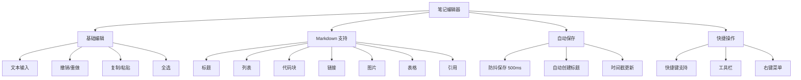

**功能需求**：

| 功能 | 描述 | 优先级 |
|------|------|--------|
| 文本编辑 | 支持多行文本输入，自动换行 | P0 |
| Markdown 语法 | 支持常用 Markdown 语法 | P0 |
| 自动保存 | 防抖 500ms 后自动保存 | P0 |
| 标题提取 | 从第一行自动提取标题 | P0 |
| 撤销/重做 | 支持 Ctrl+Z/Ctrl+Y | P1 |
| 快捷键 | 支持 Ctrl+B 加粗、Ctrl+I 斜体等 | P1 |
| 代码高亮 | 代码块语法高亮 | P2 |
| 实时预览 | Markdown 实时预览 | P2 |

#### 1.2.2 标签页管理

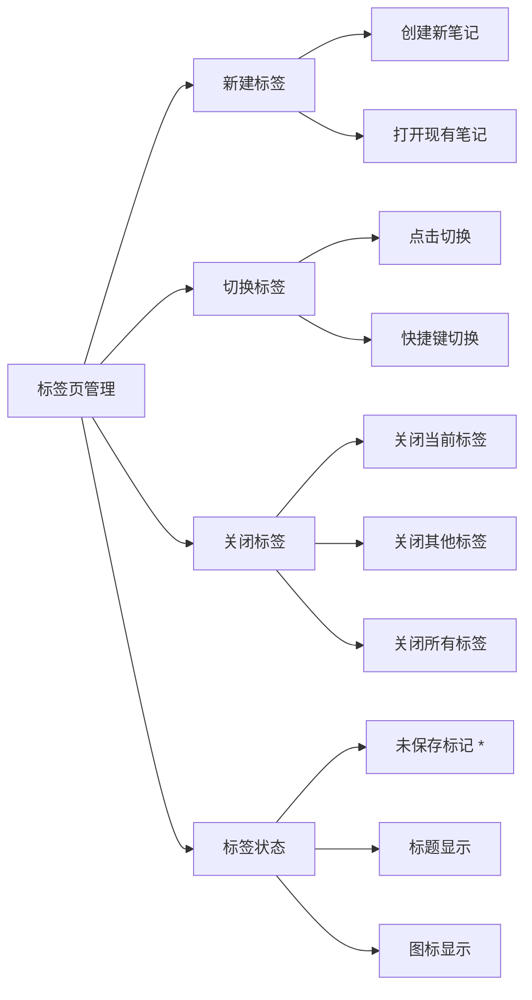

**功能需求**：

| 功能 | 描述 | 优先级 |
|------|------|--------|
| 多标签页 | 支持同时打开多个笔记 | P0 |
| 新建标签 | 点击 + 按钮创建新笔记 | P0 |
| 切换标签 | 点击标签切换笔记 | P0 |
| 关闭标签 | 点击 × 关闭标签 | P0 |
| 未保存标记 | 未保存的标签显示 * 标记 | P1 |
| 标签拖拽 | 支持拖拽排序标签 | P2 |
| 标签右键菜单 | 右键显示操作菜单 | P2 |

#### 1.2.3 笔记列表

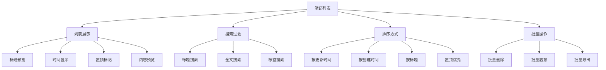

**功能需求**：

| 功能 | 描述 | 优先级 |
|------|------|--------|
| 笔记列表 | 显示所有笔记 | P0 |
| 置顶笔记 | 置顶笔记显示在最前 | P0 |
| 搜索功能 | 支持标题和内容搜索 | P0 |
| 排序功能 | 支持多种排序方式 | P1 |
| 笔记预览 | 显示笔记内容预览 | P1 |
| 批量操作 | 支持批量删除、置顶 | P2 |

### 1.3 交互设计

#### 1.3.1 快捷键

| 快捷键 | 功能 | 作用域 |
|--------|------|--------|
| Ctrl+N | 新建笔记 | 全局 |
| Ctrl+S | 保存笔记 | 编辑器 |
| Ctrl+W | 关闭当前标签 | 标签页 |
| Ctrl+Tab | 切换到下一个标签 | 标签页 |
| Ctrl+Shift+Tab | 切换到上一个标签 | 标签页 |
| Ctrl+F | 搜索笔记 | 全局 |
| Ctrl+B | 加粗文本 | 编辑器 |
| Ctrl+I | 斜体文本 | 编辑器 |
| Ctrl+K | 插入链接 | 编辑器 |
| Ctrl+` | 插入代码块 | 编辑器 |

#### 1.3.2 状态指示

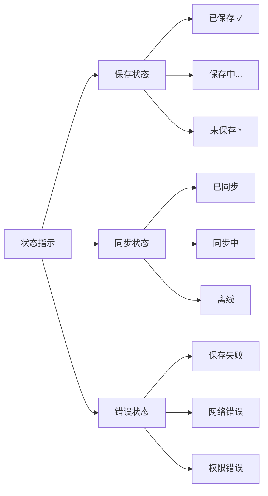

### 1.4 UI 布局

```
┌─────────────────────────────────────────────────────────────┐
│  标题栏 [置顶] [最小化] [关闭]                                │
├─────────────────────────────────────────────────────────────┤
│  导航栏 [笔记] [脚本] [搜索] [设置]                           │
├─────────────────────────────────────────────────────────────┤
│  标签栏 [笔记1*] [笔记2] [笔记3] [+]                          │
├─────────────────────────────────────────────────────────────┤
│                                                             │
│  编辑区域                                                    │
│  ┌─────────────────────────────────────────────────────┐   │
│  │ # 标题                                               │   │
│  │                                                      │   │
│  │ 正文内容...                                          │   │
│  │                                                      │   │
│  │ - 列表项1                                            │   │
│  │ - 列表项2                                            │   │
│  │                                                      │   │
│  │ ```python                                            │   │
│  │ print("Hello")                                       │   │
│  │ ```                                                  │   │
│  └─────────────────────────────────────────────────────┘   │
│                                                             │
│  状态栏 [已保存] [字数: 123] [行数: 10]                       │
└─────────────────────────────────────────────────────────────┘
```

---

## 2. 桌面美化组件

### 2.1 功能概述

桌面美化组件提供窗口外观定制、主题切换、透明度调节等功能，让用户打造个性化的桌面体验。

### 2.2 核心功能

#### 2.2.1 窗口外观

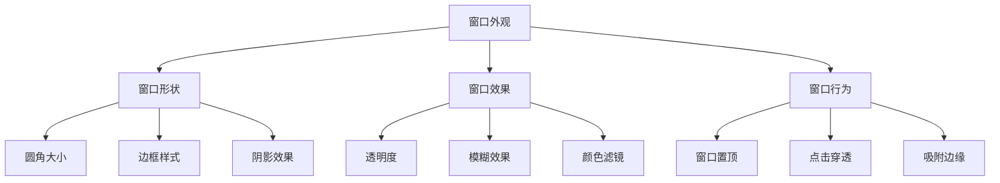

**功能需求**：

| 功能 | 描述 | 优先级 |
|------|------|--------|
| 透明度调节 | 0-100% 透明度调节 | P0 |
| 窗口置顶 | 窗口始终在最前 | P0 |
| 圆角设置 | 自定义窗口圆角大小 | P1 |
| 窗口阴影 | 自定义阴影效果 | P1 |
| 模糊背景 | 毛玻璃效果 | P2 |
| 点击穿透 | 鼠标点击穿透 | P2 |

#### 2.2.2 主题系统

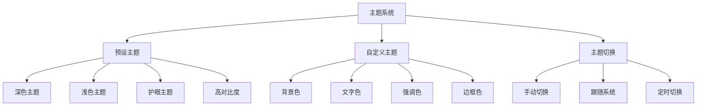

**功能需求**：

| 功能 | 描述 | 优先级 |
|------|------|--------|
| 深色主题 | 默认深色主题 | P0 |
| 浅色主题 | 浅色主题 | P0 |
| 跟随系统 | 自动跟随系统主题 | P1 |
| 自定义主题 | 用户自定义颜色 | P1 |
| 主题导入导出 | 导入导出主题配置 | P2 |

#### 2.2.3 字体设置

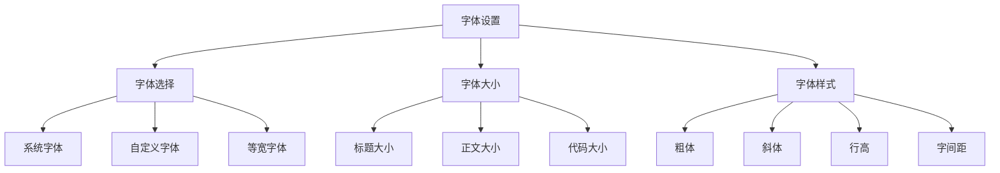

**功能需求**：

| 功能 | 描述 | 优先级 |
|------|------|--------|
| 字体选择 | 选择编辑器字体 | P1 |
| 字体大小 | 调节字体大小 | P1 |
| 行高设置 | 调节行高 | P2 |
| 字间距 | 调节字间距 | P2 |

### 2.3 桌面小组件

#### 2.3.1 快捷笔记小组件

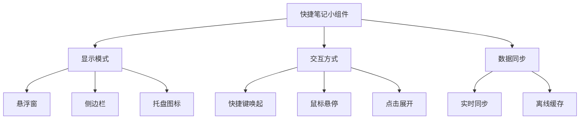

**功能需求**：

| 功能 | 描述 | 优先级 |
|------|------|--------|
| 全局快捷键 | Ctrl+Alt+D 唤起 | P0 |
| 悬浮窗口 | 小型悬浮编辑窗口 | P0 |
| 快速输入 | 快速记录想法 | P0 |
| 自动隐藏 | 失焦自动隐藏 | P1 |
| 透明度 | 支持透明度调节 | P1 |

#### 2.3.2 脚本快捷方式小组件

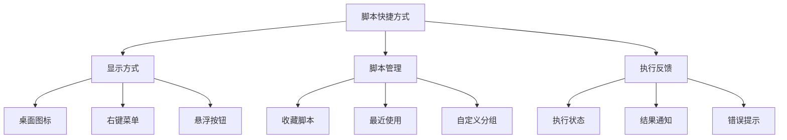

**功能需求**：

| 功能 | 描述 | 优先级 |
|------|------|--------|
| 收藏脚本 | 收藏常用脚本 | P1 |
| 快捷执行 | 一键执行脚本 | P1 |
| 执行反馈 | 显示执行状态 | P1 |
| 结果通知 | 执行结果通知 | P2 |

### 2.4 UI 布局

```
┌─────────────────────────────────────────────────────────────┐
│  设置 > 外观                                                 │
├─────────────────────────────────────────────────────────────┤
│                                                             │
│  主题                                                       │
│  ┌─────────┐ ┌─────────┐ ┌─────────┐ ┌─────────┐          │
│  │  深色   │ │  浅色   │ │  护眼   │ │  自定义  │          │
│  └─────────┘ └─────────┘ └─────────┘ └─────────┘          │
│                                                             │
│  窗口                                                       │
│  ┌─────────────────────────────────────────────────────┐   │
│  │ 透明度: [====○====] 80%                              │   │
│  │ 圆角:   [==○======] 8px                              │   │
│  │ ☑ 窗口置顶                                          │   │
│  │ ☐ 点击穿透                                          │   │
│  │ ☑ 模糊背景                                          │   │
│  └─────────────────────────────────────────────────────┘   │
│                                                             │
│  字体                                                       │
│  ┌─────────────────────────────────────────────────────┐   │
│  │ 字体: [Consolas        ▼]                           │   │
│  │ 大小: [14px            ▼]                           │   │
│  │ 行高: [1.6             ▼]                           │   │
│  └─────────────────────────────────────────────────────┘   │
│                                                             │
└─────────────────────────────────────────────────────────────┘
```

---

## 3. 脚本管理页

### 3.1 功能概述

脚本管理页提供脚本发现、查看、执行、收藏等功能，是用户管理脚本的主要界面。

### 3.2 核心功能

#### 3.2.1 脚本列表

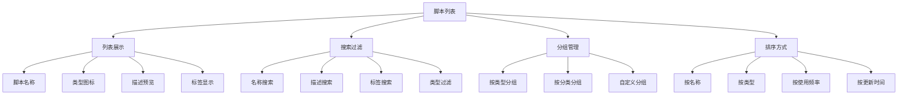

**功能需求**：

| 功能 | 描述 | 优先级 |
|------|------|--------|
| 脚本列表 | 显示所有可用脚本 | P0 |
| 类型图标 | 根据脚本类型显示图标 | P0 |
| 搜索功能 | 支持名称和描述搜索 | P0 |
| 类型过滤 | 按脚本类型过滤 | P1 |
| 分类分组 | 按分类分组显示 | P1 |
| 收藏标记 | 显示收藏状态 | P1 |
| 使用频率 | 显示使用频率 | P2 |

#### 3.2.2 脚本详情

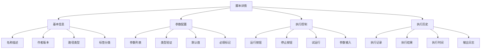

**功能需求**：

| 功能 | 描述 | 优先级 |
|------|------|--------|
| 基本信息 | 显示脚本名称、描述等 | P0 |
| 参数配置 | 配置脚本参数 | P0 |
| 执行按钮 | 执行脚本 | P0 |
| 执行结果 | 显示执行结果 | P0 |
| 参数验证 | 验证参数类型 | P1 |
| 试运行 | 试运行模式 | P1 |
| 执行历史 | 显示执行历史 | P2 |

#### 3.2.3 脚本执行

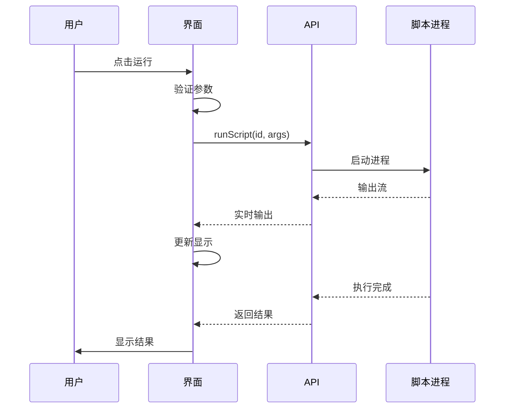

**功能需求**：

| 功能 | 描述 | 优先级 |
|------|------|--------|
| 参数输入 | 输入脚本参数 | P0 |
| 执行状态 | 显示执行状态 | P0 |
| 实时输出 | 显示实时输出 | P1 |
| 取消执行 | 取消正在执行的脚本 | P1 |
| 输出高亮 | 输出内容高亮 | P2 |
| 输出导出 | 导出输出内容 | P2 |

#### 3.2.4 收藏管理

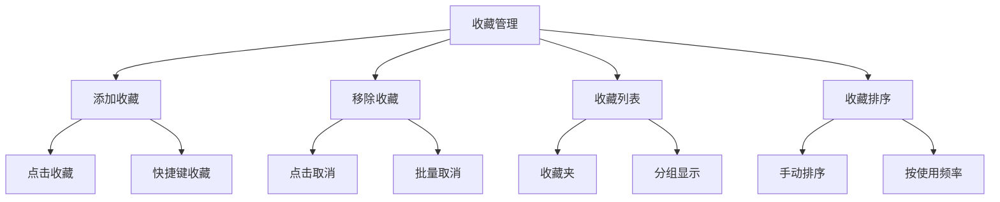

**功能需求**：

| 功能 | 描述 | 优先级 |
|------|------|--------|
| 收藏脚本 | 收藏常用脚本 | P1 |
| 取消收藏 | 取消收藏 | P1 |
| 收藏列表 | 显示收藏的脚本 | P1 |
| 收藏排序 | 收藏脚本排序 | P2 |

### 3.3 交互设计

#### 3.3.1 快捷键

| 快捷键 | 功能 | 作用域 |
|--------|------|--------|
| Ctrl+R | 运行脚本 | 脚本详情 |
| Ctrl+Shift+R | 试运行 | 脚本详情 |
| Ctrl+D | 收藏/取消收藏 | 脚本列表 |
| Ctrl+F | 搜索脚本 | 脚本列表 |
| Escape | 清除选择 | 全局 |

#### 3.3.2 状态指示

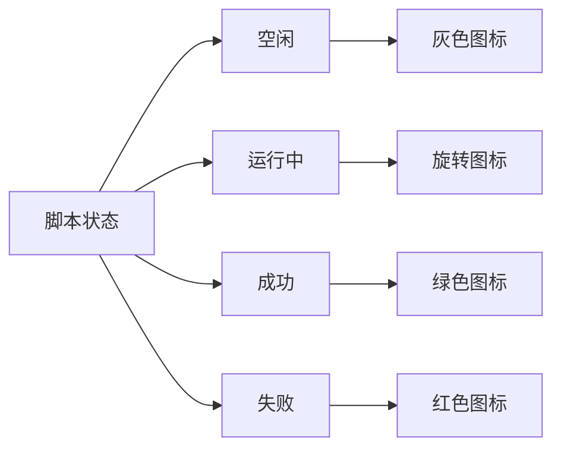

### 3.4 UI 布局

```
┌─────────────────────────────────────────────────────────────┐
│  搜索脚本... [🔍]                              [刷新 🔄]    │
├─────────────────────────────────────────────────────────────┤
│                    │                                         │
│  脚本列表          │  脚本详情                                │
│  ┌──────────────┐ │  ┌────────────────────────────────────┐│
│  │ 💻 脚本1     │ │  │ # 脚本名称                         ││
│  │   PowerShell │ │  │                                    ││
│  ├──────────────┤ │  │ 描述信息...                        ││
│  │ 🐍 脚本2 ★   │ │  │                                    ││
│  │   Python     │ │  │ 类型: PowerShell                   ││
│  ├──────────────┤ │  │ 作者: user                         ││
│  │ 📄 脚本3     │ │  │ 版本: 1.0.0                        ││
│  │   Batch      │ │  │                                    ││
│  └──────────────┘ │  │ 参数:                              ││
│                    │  │ ┌────────────────────────────────┐││
│  过滤: [全部 ▼]   │  │ │ 参数1: [输入框        ]         │││
│                    │  │ │ 参数2: [输入框        ]         │││
│                    │  │ └────────────────────────────────┘││
│                    │  │                                    ││
│                    │  │ [▶ 运行] [⏹ 停止] [⭐ 收藏]      ││
│                    │  └────────────────────────────────────┘│
│                    │                                         │
│                    │  执行结果                                │
│                    │  ┌────────────────────────────────────┐│
│                    │  │ ✓ 成功  退出码: 0  耗时: 1.2s     ││
│                    │  │                                    ││
│                    │  │ 输出:                              ││
│                    │  │ Hello World                        ││
│                    │  └────────────────────────────────────┘│
└─────────────────────────────────────────────────────────────┘
```

---

## 4. 笔记管理页

### 4.1 功能概述

笔记管理页提供笔记的高级管理功能，包括批量操作、导入导出、标签管理等。

### 4.2 核心功能

#### 4.2.1 笔记管理

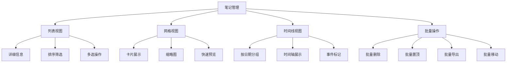

**功能需求**：

| 功能 | 描述 | 优先级 |
|------|------|--------|
| 列表视图 | 详细列表展示 | P0 |
| 网格视图 | 卡片网格展示 | P1 |
| 批量选择 | 多选笔记 | P1 |
| 批量删除 | 批量删除笔记 | P1 |
| 批量置顶 | 批量置顶笔记 | P2 |
| 时间线视图 | 按时间展示 | P2 |

#### 4.2.2 标签系统

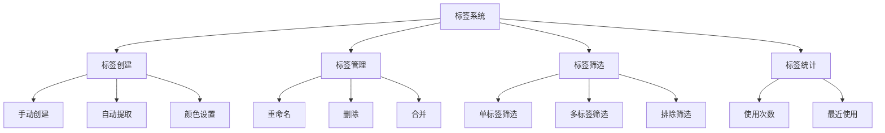

**功能需求**：

| 功能 | 描述 | 优先级 |
|------|------|--------|
| 添加标签 | 为笔记添加标签 | P1 |
| 标签筛选 | 按标签筛选笔记 | P1 |
| 标签管理 | 管理标签 | P2 |
| 标签颜色 | 自定义标签颜色 | P2 |
| 标签统计 | 显示标签使用统计 | P2 |

#### 4.2.3 导入导出

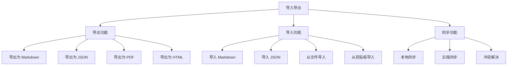

**功能需求**：

| 功能 | 描述 | 优先级 |
|------|------|--------|
| 导出 Markdown | 导出为 .md 文件 | P1 |
| 导出 JSON | 导出为 .json 文件 | P1 |
| 导入 Markdown | 导入 .md 文件 | P1 |
| 导入 JSON | 导入 .json 文件 | P1 |
| 批量导出 | 批量导出笔记 | P2 |
| 云端同步 | 云端同步笔记 | P2 |

### 4.3 UI 布局

```
┌─────────────────────────────────────────────────────────────┐
│  笔记管理                                                    │
├─────────────────────────────────────────────────────────────┤
│  [列表] [网格] [时间线]     搜索... [🔍]     [导入] [导出]  │
├─────────────────────────────────────────────────────────────┤
│                    │                                         │
│  标签筛选          │  笔记列表                                │
│  ┌──────────────┐ │  ┌────────────────────────────────────┐│
│  │ 全部 (123)   │ │  │ ☐ 笔记1          2026-03-17  ★    ││
│  │ 工作 (45)    │ │  │   这是笔记内容预览...               ││
│  │ 学习 (32)    │ │  ├────────────────────────────────────┤│
│  │ 生活 (28)    │ │  │ ☐ 笔记2          2026-03-16       ││
│  │ 其他 (18)    │ │  │   这是笔记内容预览...               ││
│  └──────────────┘ │  ├────────────────────────────────────┤│
│                    │  │ ☐ 笔记3          2026-03-15  ★    ││
│  排序方式          │  │   这是笔记内容预览...               ││
│  ┌──────────────┐ │  └────────────────────────────────────┘│
│  │ 更新时间 ▼   │ │                                         │
│  └──────────────┘ │  已选择: 0 项                           │
│                    │  [删除] [置顶] [导出]                   │
└─────────────────────────────────────────────────────────────┘
```

---

## 5. 设置页面

### 5.1 功能概述

设置页面提供应用的各项配置功能，包括外观、快捷键、数据管理等。

### 5.2 设置分类

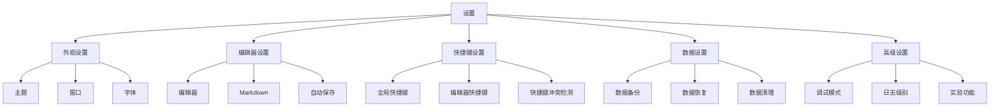

### 5.3 UI 布局

```
┌─────────────────────────────────────────────────────────────┐
│  设置                                                        │
├─────────────────────────────────────────────────────────────┤
│                    │                                         │
│  设置分类          │  外观设置                                │
│  ┌──────────────┐ │  ┌────────────────────────────────────┐│
│  │ ▶ 外观       │ │  │                                    ││
│  │   编辑器     │ │  │ 主题                               ││
│  │   快捷键     │ │  │ ┌────┐ ┌────┐ ┌────┐ ┌────┐      ││
│  │   数据       │ │  │ │深色│ │浅色│ │护眼│ │自定义│     ││
│  │   高级       │ │  │ └────┘ └────┘ └────┘ └────┘      ││
│  └──────────────┘ │  │                                    ││
│                    │  │ 窗口                               ││
│                    │  │ 透明度: [====○====] 80%            ││
│                    │  │ 圆角:   [==○======] 8px            ││
│                    │  │ ☑ 窗口置顶                         ││
│                    │  │                                    ││
│                    │  │ 字体                               ││
│                    │  │ 字体: [Consolas        ▼]          ││
│                    │  │ 大小: [14px            ▼]          ││
│                    │  └────────────────────────────────────┘│
└─────────────────────────────────────────────────────────────┘
```

---

## 6. 通用组件

### 6.1 导航栏

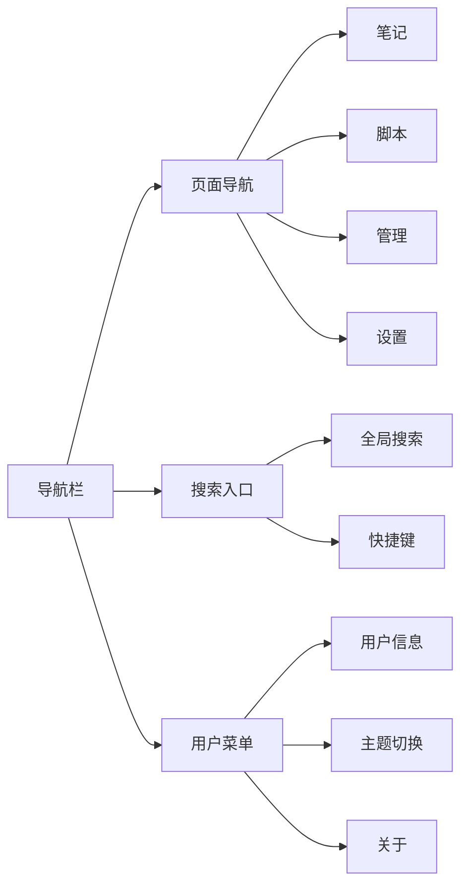

### 6.2 状态栏

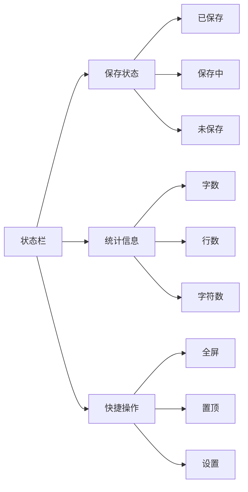

### 6.3 通知系统

```mermaid
graph TB
    A[通知系统] --> B[成功通知]
    A --> C[警告通知]
    A --> D[错误通知]
    A --> E[信息通知]
    
    B --> B1[绿色图标]
    B --> B2[自动消失]
    
    C --> C1[黄色图标]
    C --> C2[手动关闭]
    
    D --> D1[红色图标]
    D --> D2[手动关闭]
    D --> D3[错误详情]
    
    E --> E1[蓝色图标]
    E --> E2[自动消失]
```

---

## 7. 响应式设计

### 7.1 窗口尺寸

| 模式 | 宽度 | 高度 | 说明 |
|------|------|------|------|
| 紧凑模式 | 400px | 600px | 最小窗口尺寸 |
| 标准模式 | 800px | 600px | 默认窗口尺寸 |
| 宽屏模式 | 1200px+ | 800px+ | 大屏幕优化 |

### 7.2 布局适配

```mermaid
graph TB
    A[布局适配] --> B[紧凑模式]
    A --> C[标准模式]
    A --> D[宽屏模式]
    
    B --> B1[隐藏侧边栏]
    B --> B2[简化工具栏]
    B --> B3[折叠面板]
    
    C --> C1[显示侧边栏]
    C --> C2[完整工具栏]
    C --> C3[展开面板]
    
    D --> D1[多列布局]
    D --> D2[扩展面板]
    D --> D3[快捷面板]
```

---

## 8. 无障碍设计

### 8.1 键盘导航

- 所有功能可通过键盘访问
- Tab 键顺序合理
- 焦点状态清晰可见
- 快捷键提示完整

### 8.2 屏幕阅读器支持

- 语义化 HTML 结构
- ARIA 标签完整
- 状态变化通知
- 错误信息可读

### 8.3 视觉辅助

- 高对比度主题
- 可调节字体大小
- 清晰的焦点指示
- 颜色不作为唯一标识

---

## 9. 性能要求

### 9.1 响应时间

| 操作 | 响应时间 | 说明 |
|------|----------|------|
| 页面切换 | < 100ms | 立即响应 |
| 笔记保存 | < 200ms | 防抖后 |
| 脚本列表加载 | < 500ms | 首次加载 |
| 搜索响应 | < 300ms | 输入后 |

### 9.2 资源占用

| 资源 | 限制 | 说明 |
|------|------|------|
| 内存占用 | < 200MB | 正常使用 |
| CPU 占用 | < 5% | 空闲状态 |
| 磁盘占用 | < 100MB | 应用本身 |

---

## 10. 兼容性要求

### 10.1 操作系统

- Windows 10+
- macOS 10.15+
- Ubuntu 20.04+

### 10.2 显示器

- 最小分辨率: 1366x768
- 推荐分辨率: 1920x1080
- 支持高 DPI 显示

---

## 附录：优先级说明

| 优先级 | 说明 | 时间规划 |
|--------|------|----------|
| P0 | 核心功能，必须实现 | 第一阶段 |
| P1 | 重要功能，应该实现 | 第二阶段 |
| P2 | 增强功能，可以实现 | 第三阶段 |

---

## 版本历史

| 版本 | 日期 | 说明 |
|------|------|------|
| 1.0 | 2026-03-17 | 初始版本 |
