# Deskflow 架构设计

## 概述

Deskflow 是一个基于 React + Tauri 的桌面应用，采用分层架构设计，通过 Tauri IPC 与后端 Go 核心通信。前端主要负责用户界面展示、交互逻辑和状态管理，后端由 Tauri Rust Runtime 和 Go Core 组成，提供脚本管理和笔记存储功能。

## 整体架构

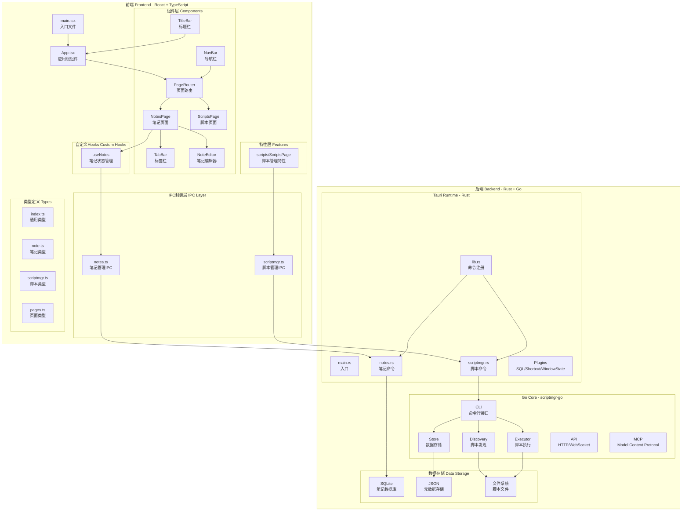
```mermaid
graph TB
    subgraph "前端 Frontend - React + TypeScript"
        A[App.tsx<br/>应用根组件]
        B[main.tsx<br/>入口文件]
        
        subgraph "组件层 Components"
            C1[TitleBar<br/>标题栏]
            C2[NavBar<br/>导航栏]
            C3[TabBar<br/>标签栏]
            C4[PageRouter<br/>页面路由]
            C5[NotesPage<br/>笔记页面]
            C6[NoteEditor<br/>笔记编辑器]
            C7[ScriptsPage<br/>脚本页面]
        end
        
        subgraph "特性层 Features"
            F1[scripts/ScriptsPage<br/>脚本管理特性]
        end
        
        subgraph "自定义Hooks Custom Hooks"
            H1[useNotes<br/>笔记状态管理]
        end
        
        subgraph "IPC封装层 IPC Layer"
            I1[scriptmgr.ts<br/>脚本管理IPC]
            I2[notes.ts<br/>笔记管理IPC]
        end
        
        subgraph "类型定义 Types"
            T1[index.ts<br/>通用类型]
            T2[note.ts<br/>笔记类型]
            T3[scriptmgr.ts<br/>脚本类型]
            T4[pages.ts<br/>页面类型]
        end
    end
    
    subgraph "后端 Backend - Rust + Go"
        subgraph "Tauri Runtime - Rust"
            R1[main.rs<br/>入口]
            R2[lib.rs<br/>命令注册]
            R3[scriptmgr.rs<br/>脚本命令]
            R4[notes.rs<br/>笔记命令]
            R5[Plugins<br/>SQL/Shortcut/WindowState]
        end
        
        subgraph "Go Core - scriptmgr-go"
            G1[CLI<br/>命令行接口]
            G2[Discovery<br/>脚本发现]
            G3[Executor<br/>脚本执行]
            G4[Store<br/>数据存储]
            G5[API<br/>HTTP/WebSocket]
            G6[MCP<br/>Model Context Protocol]
        end
        
        subgraph "数据存储 Data Storage"
            D1[SQLite<br/>笔记数据库]
            D2[JSON<br/>元数据存储]
            D3[文件系统<br/>脚本文件]
        end
    end
    
    B --> A
    A --> C4
    C4 --> C5
    C4 --> C7
    C5 --> C6
    C5 --> H1
    C5 --> C3
    C2 --> C4
    C1 --> A
    H1 --> I2
    F1 --> I1
    I1 --> R3
    I2 --> R4
    R3 --> G1
    R4 --> D1
    R2 --> R3
    R2 --> R4
    G1 --> G2
    G1 --> G3
    G1 --> G4
    G2 --> D3
    G3 --> D3
    G4 --> D2
```

## 目录结构

```
src/
├── main.tsx                 # 应用入口
├── App.tsx                  # 根组件
├── styles.css               # 全局样式
├── vite-env.d.ts            # Vite 类型声明
│
├── components/              # UI 组件层
│   ├── TitleBar.tsx         # 窗口标题栏
│   ├── NavBar.tsx           # 导航栏
│   ├── TabBar.tsx           # 标签页栏
│   ├── PageRouter.tsx       # 页面路由组件
│   ├── NotesPage.tsx        # 笔记页面
│   ├── NoteEditor.tsx       # 笔记编辑器
│   └── ScriptsPage.tsx      # 脚本页面
│
├── features/                # 功能特性层
│   └── scripts/
│       └── ScriptsPage.tsx  # 脚本管理页面
│
├── hooks/                   # 自定义 Hooks
│   └── useNotes.ts          # 笔记状态管理 Hook
│
├── lib/                     # 工具库
│   └── tauri/              # Tauri IPC 封装
│       ├── index.ts         # 统一导出
│       ├── scriptmgr.ts     # 脚本管理 IPC
│       └── notes.ts         # 笔记管理 IPC
│
├── types/                   # TypeScript 类型定义
│   ├── index.ts             # 通用类型
│   ├── note.ts              # 笔记相关类型
│   ├── scriptmgr.ts         # 脚本管理类型
│   └── pages.ts             # 页面类型
│
└── assets/                  # 静态资源
    └── react.svg
```

## 核心模块设计

### 1. 应用入口层

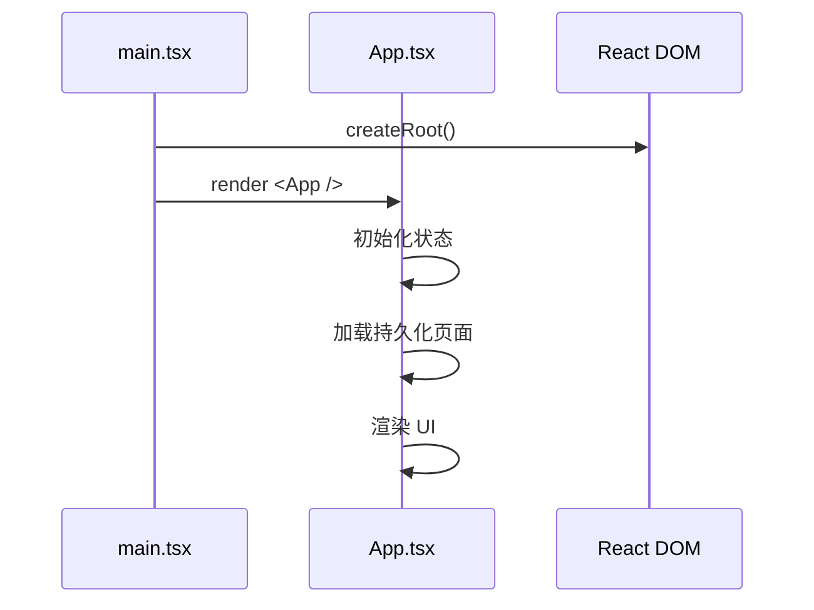
```mermaid
sequenceDiagram
    participant M as main.tsx
    participant A as App.tsx
    participant R as React DOM
    
    M->>R: createRoot()
    M->>A: render <App />
    A->>A: 初始化状态
    A->>A: 加载持久化页面
    A->>A: 渲染 UI
```

**职责**：
- `main.tsx`: React 应用挂载入口
- `App.tsx`: 应用根组件，管理全局状态和布局

**关键特性**：
- 使用 localStorage 持久化当前页面状态
- 管理窗口置顶状态
- 提供页面切换功能

### 2. 组件层

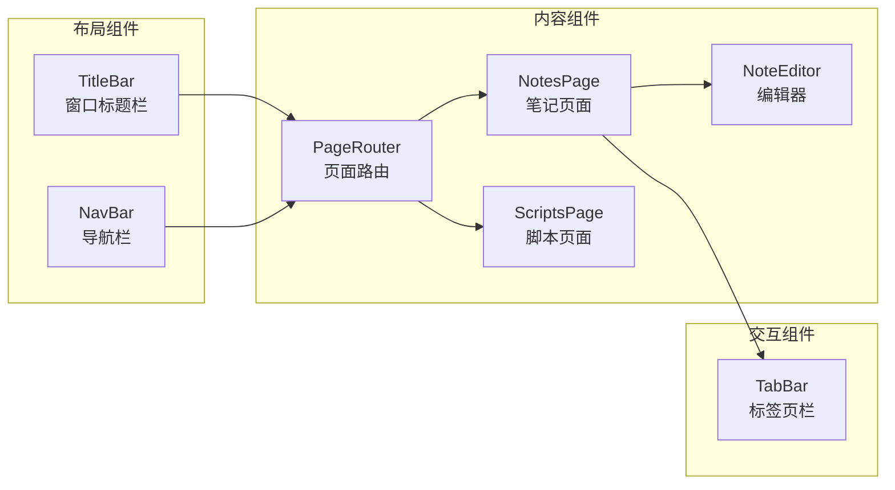
```mermaid
graph LR
    subgraph "布局组件"
        A[TitleBar<br/>窗口标题栏]
        B[NavBar<br/>导航栏]
    end
    
    subgraph "内容组件"
        C[PageRouter<br/>页面路由]
        D[NotesPage<br/>笔记页面]
        E[NoteEditor<br/>编辑器]
        F[ScriptsPage<br/>脚本页面]
    end
    
    subgraph "交互组件"
        G[TabBar<br/>标签页栏]
    end
    
    A --> C
    B --> C
    C --> D
    C --> F
    D --> E
    D --> G
```

**组件职责**：

| 组件 | 职责 |
|------|------|
| TitleBar | 窗口标题显示、置顶切换 |
| NavBar | 页面导航切换 |
| TabBar | 笔记标签页管理 |
| PageRouter | 根据页面类型路由到对应组件 |
| NotesPage | 笔记列表和编辑器容器 |
| NoteEditor | 笔记内容编辑 |
| ScriptsPage | 脚本列表和执行界面 |

### 3. 状态管理层

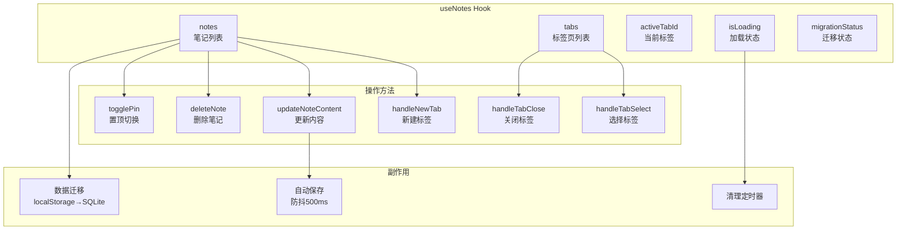
```mermaid
graph TB
    subgraph "useNotes Hook"
        A[notes<br/>笔记列表]
        B[tabs<br/>标签页列表]
        C[activeTabId<br/>当前标签]
        D[isLoading<br/>加载状态]
        E[migrationStatus<br/>迁移状态]
    end
    
    subgraph "操作方法"
        F[handleNewTab<br/>新建标签]
        G[handleTabSelect<br/>选择标签]
        H[handleTabClose<br/>关闭标签]
        I[updateNoteContent<br/>更新内容]
        J[deleteNote<br/>删除笔记]
        K[togglePin<br/>置顶切换]
    end
    
    subgraph "副作用"
        L[自动保存<br/>防抖500ms]
        M[数据迁移<br/>localStorage→SQLite]
        N[清理定时器]
    end
    
    A --> F
    B --> G
    B --> H
    A --> I
    A --> J
    A --> K
    I --> L
    A --> M
    D --> N
```

**useNotes Hook 特性**：

1. **状态管理**
   - 笔记列表状态
   - 标签页状态
   - 当前激活标签
   - 加载状态

2. **数据持久化**
   - 自动保存（防抖 500ms）
   - localStorage 页面状态
   - SQLite 笔记数据

3. **数据迁移**
   - 从 localStorage 迁移到 SQLite
   - 迁移状态追踪
   - 向后兼容旧数据

4. **操作方法**
   - 新建/选择/关闭标签
   - 更新笔记内容
   - 删除笔记
   - 切换置顶状态

### 4. IPC 封装层

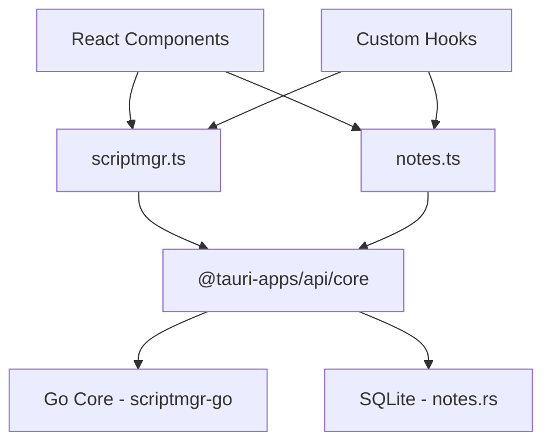
```mermaid
graph TB
    A[React Components]
    B[Custom Hooks]
    C[scriptmgr.ts]
    D[notes.ts]
    E["@tauri-apps/api/core"]
    F["Go Core - scriptmgr-go"]
    G["SQLite - notes.rs"]
    
    A --> C
    A --> D
    B --> C
    B --> D
    C --> E
    D --> E
    E --> F
    E --> G
```

**IPC 封装职责**：

#### scriptmgr.ts
- `listScripts()`: 列出所有脚本
- `describeScript()`: 获取脚本详情
- `runScript()`: 执行脚本
- 工具函数：格式化时长、状态颜色、输出截断

#### notes.ts
- `listNotes()`: 列出所有笔记
- `getNote()`: 获取单个笔记
- `saveNote()`: 保存笔记
- `createNote()`: 创建新笔记
- `deleteNote()`: 删除笔记
- `searchNotes()`: 搜索笔记
- `togglePinNote()`: 切换置顶状态

### 5. 类型系统

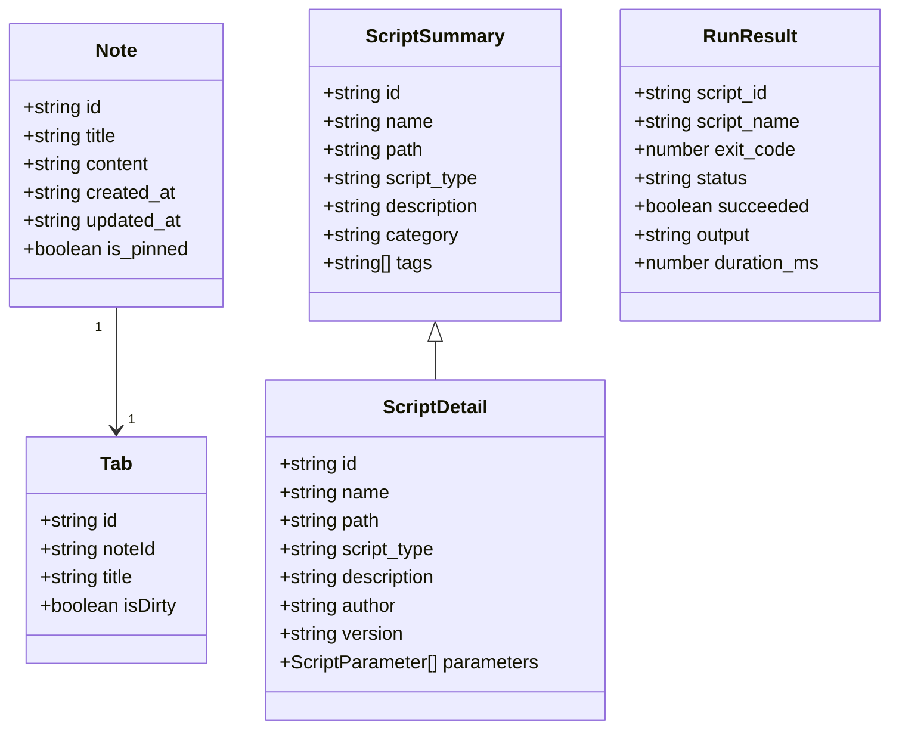
```mermaid
classDiagram
    class Note {
        +string id
        +string title
        +string content
        +string created_at
        +string updated_at
        +boolean is_pinned
    }
    
    class Tab {
        +string id
        +string noteId
        +string title
        +boolean isDirty
    }
    
    class ScriptSummary {
        +string id
        +string name
        +string path
        +string script_type
        +string description
        +string category
        +string[] tags
    }
    
    class ScriptDetail {
        +string id
        +string name
        +string path
        +string script_type
        +string description
        +string author
        +string version
        +ScriptParameter[] parameters
    }
    
    class RunResult {
        +string script_id
        +string script_name
        +number exit_code
        +string status
        +boolean succeeded
        +string output
        +number duration_ms
    }
    
    Note "1" --> "1" Tab
    ScriptSummary <|-- ScriptDetail
```

**类型定义分类**：

| 文件 | 类型 | 用途 |
|------|------|------|
| index.ts | WindowState, AppSettings | 通用应用状态 |
| note.ts | Note, Tab, *Response | 笔记相关类型 |
| scriptmgr.ts | ScriptSummary, ScriptDetail, RunResult | 脚本管理类型 |
| pages.ts | PageType | 页面类型枚举 |

## 数据流设计

### 笔记功能数据流

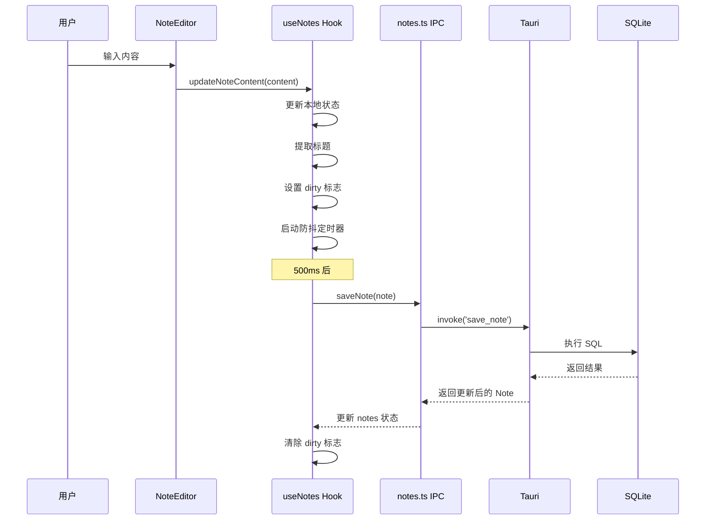
```mermaid
sequenceDiagram
    participant U as 用户
    participant C as NoteEditor
    participant H as useNotes Hook
    participant I as notes.ts IPC
    participant T as Tauri
    participant S as SQLite
    
    U->>C: 输入内容
    C->>H: updateNoteContent(content)
    H->>H: 更新本地状态
    H->>H: 提取标题
    H->>H: 设置 dirty 标志
    H->>H: 启动防抖定时器
    Note over H: 500ms 后
    H->>I: saveNote(note)
    I->>T: invoke('save_note')
    T->>S: 执行 SQL
    S-->>T: 返回结果
    T-->>I: 返回更新后的 Note
    I-->>H: 更新 notes 状态
    H->>H: 清除 dirty 标志
```

### 脚本功能数据流

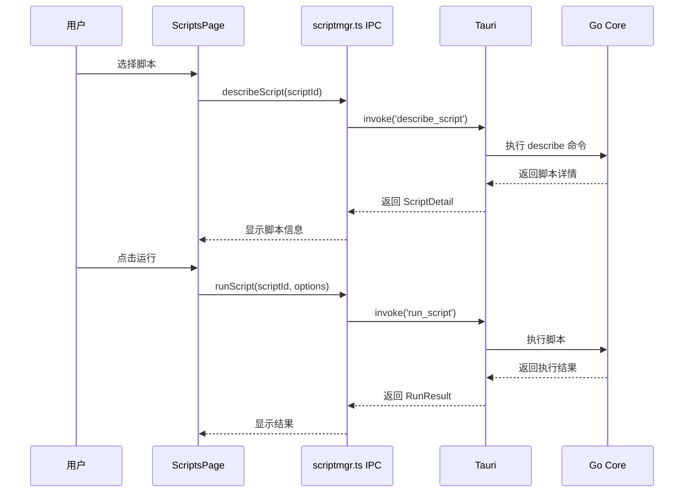
```mermaid
sequenceDiagram
    participant U as 用户
    participant C as ScriptsPage
    participant I as scriptmgr.ts IPC
    participant T as Tauri
    participant G as Go Core
    
    U->>C: 选择脚本
    C->>I: describeScript(scriptId)
    I->>T: invoke('describe_script')
    T->>G: 执行 describe 命令
    G-->>T: 返回脚本详情
    T-->>I: 返回 ScriptDetail
    I-->>C: 显示脚本信息
    
    U->>C: 点击运行
    C->>I: runScript(scriptId, options)
    I->>T: invoke('run_script')
    T->>G: 执行脚本
    G-->>T: 返回执行结果
    T-->>I: 返回 RunResult
    I-->>C: 显示结果
```

## 状态管理策略

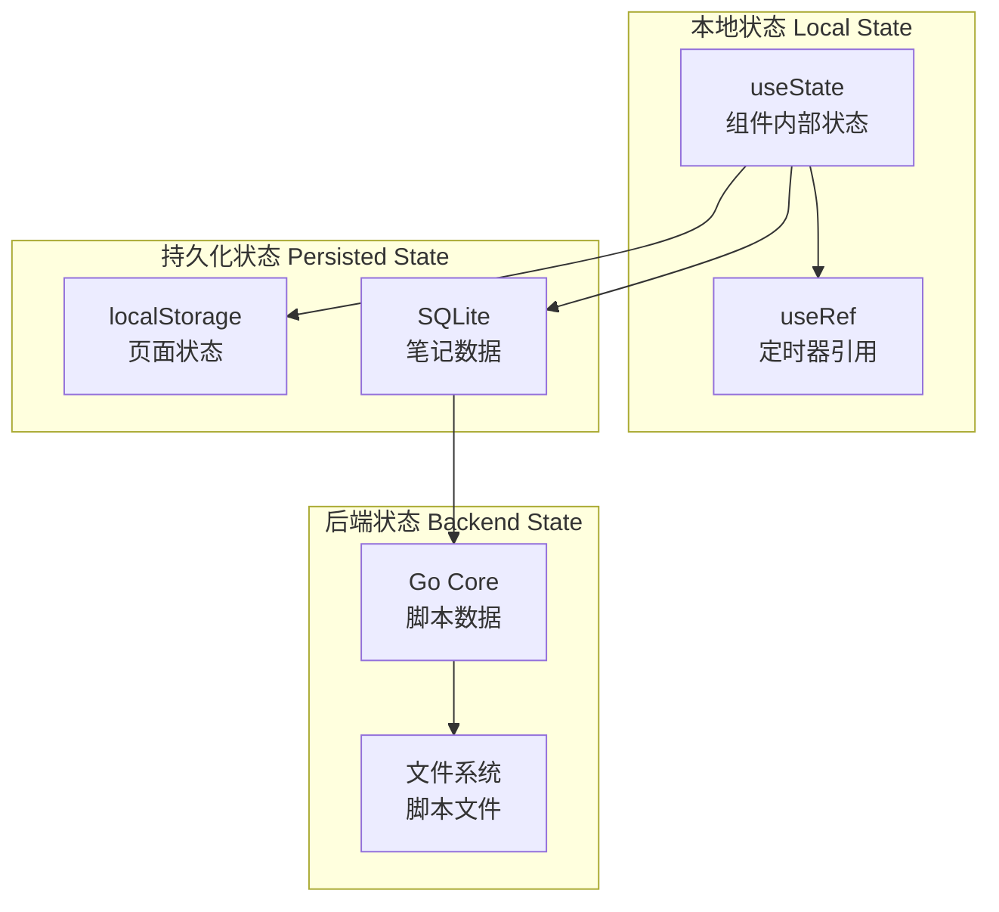
```mermaid
graph TB
    subgraph "本地状态 Local State"
        A1[useState<br/>组件内部状态]
        A2[useRef<br/>定时器引用]
    end
    
    subgraph "持久化状态 Persisted State"
        B1[localStorage<br/>页面状态]
        B2[SQLite<br/>笔记数据]
    end
    
    subgraph "后端状态 Backend State"
        C1[Go Core<br/>脚本数据]
        C2[文件系统<br/>脚本文件]
    end
    
    A1 --> A2
    A1 --> B1
    A1 --> B2
    B2 --> C1
    C1 --> C2
```

**状态管理原则**：

1. **本地状态**：使用 React Hooks (useState, useRef)
2. **页面状态**：使用 localStorage 持久化
3. **业务数据**：通过 IPC 与后端同步
4. **防抖优化**：避免频繁 IPC 调用

## 通信协议

### Tauri IPC 调用

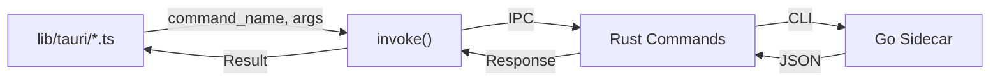
```mermaid
graph LR
    A[lib/tauri/*.ts]
    B["invoke()"]
    C["Rust Commands"]
    D["Go Sidecar"]
    
    A -->|command_name, args| B
    B -->|IPC| C
    C -->|CLI| D
    D -->|JSON| C
    C -->|Response| B
    B -->|Result| A
```

**IPC 命令列表**：

| 命令 | 参数 | 返回值 | 用途 |
|------|------|--------|------|
| list_scripts | search? | ListResponse | 列出脚本 |
| describe_script | scriptId | DescribeResponse | 获取脚本详情 |
| run_script | scriptId, args?, dryRun? | RunResult | 执行脚本 |
| list_notes | - | ListNotesResponse | 列出笔记 |
| get_note | id | GetNoteResponse | 获取笔记 |
| save_note | note | SaveNoteResponse | 保存笔记 |
| create_note | - | SaveNoteResponse | 创建笔记 |
| delete_note | id | DeleteNoteResponse | 删除笔记 |
| search_notes | query | SearchNotesResponse | 搜索笔记 |
| toggle_pin_note | id | SaveNoteResponse | 切换置顶 |
| toggle_always_on_top | - | boolean | 切换置顶 |

## 错误处理

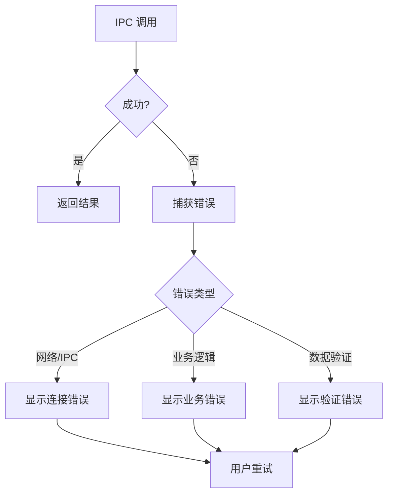
```mermaid
graph TB
    A[IPC 调用] --> B{成功?}
    B -->|是| C[返回结果]
    B -->|否| D[捕获错误]
    D --> E{错误类型}
    E -->|网络/IPC| F[显示连接错误]
    E -->|业务逻辑| G[显示业务错误]
    E -->|数据验证| H[显示验证错误]
    F --> I[用户重试]
    G --> I
    H --> I
```

**错误处理策略**：

1. **IPC 错误**：try-catch 捕获，显示友好提示
2. **业务错误**：检查响应 ok 字段，抛出 Error
3. **数据验证**：类型检查，运行时验证
4. **用户反馈**：控制台日志 + UI 提示

## 性能优化

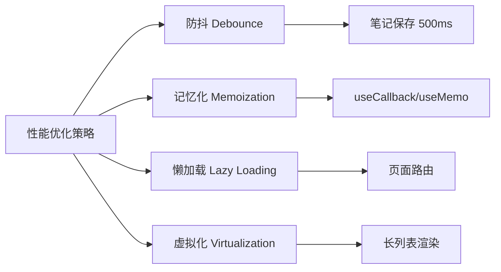
```mermaid
graph LR
    A[性能优化策略]
    
    A --> B[防抖 Debounce]
    A --> C[记忆化 Memoization]
    A --> D[懒加载 Lazy Loading]
    A --> E[虚拟化 Virtualization]
    
    B --> B1[笔记保存 500ms]
    C --> C1[useCallback/useMemo]
    D --> D1[页面路由]
    E --> E1[长列表渲染]
```

**优化措施**：

1. **防抖**：笔记内容更新 500ms 后保存
2. **记忆化**：使用 useCallback/useMemo 避免重复计算
3. **懒加载**：按需加载页面组件
4. **清理定时器**：组件卸载时清理所有定时器

## 安全考虑

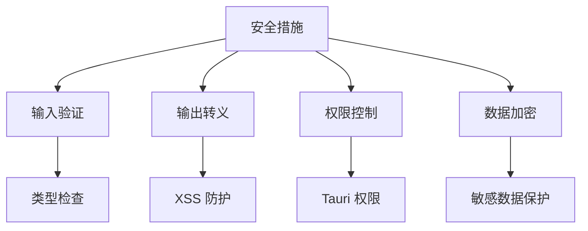
```mermaid
graph TB
    A[安全措施]
    
    A --> B[输入验证]
    A --> C[输出转义]
    A --> D[权限控制]
    A --> E[数据加密]
    
    B --> B1[类型检查]
    C --> C1[XSS 防护]
    D --> D1[Tauri 权限]
    E --> E1[敏感数据保护]
```

**安全策略**：

1. **输入验证**：TypeScript 类型检查 + 运行时验证
2. **输出转义**：React 默认 XSS 防护
3. **权限控制**：Tauri capability 配置
4. **数据保护**：不在前端存储敏感信息

## 扩展性设计

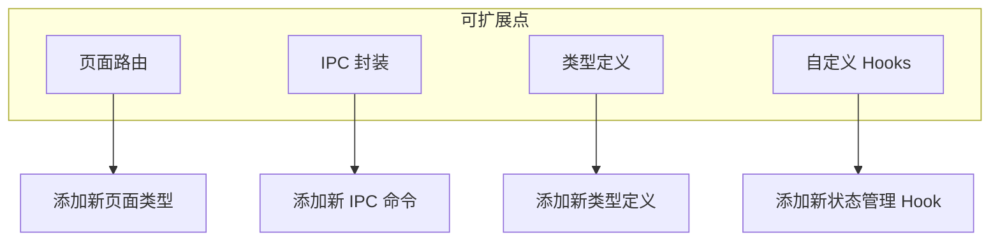
```mermaid
graph TB
    subgraph "可扩展点"
        A[页面路由]
        B[IPC 封装]
        C[类型定义]
        D[自定义 Hooks]
    end
    
    A --> A1[添加新页面类型]
    B --> B1[添加新 IPC 命令]
    C --> C1[添加新类型定义]
    D --> D1[添加新状态管理 Hook]
```

**扩展点**：

1. **新增页面**：在 PageRouter 添加 case，创建新组件
2. **新增 IPC**：在 lib/tauri 添加封装函数
3. **新增类型**：在 types 添加类型定义
4. **新增 Hook**：在 hooks 创建自定义 Hook

---

## 后端架构详解

### Tauri Runtime (Rust)

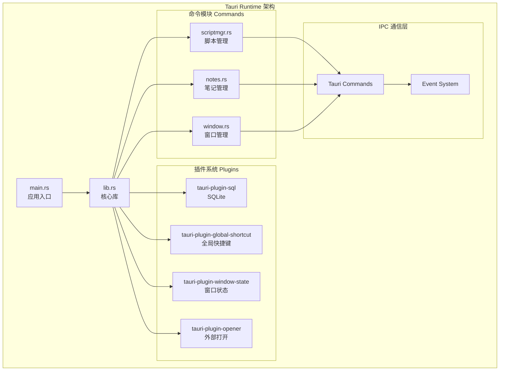
```mermaid
graph TB
    subgraph "Tauri Runtime 架构"
        A[main.rs<br/>应用入口]
        B[lib.rs<br/>核心库]
        
        subgraph "命令模块 Commands"
            C1[scriptmgr.rs<br/>脚本管理]
            C2[notes.rs<br/>笔记管理]
            C3[window.rs<br/>窗口管理]
        end
        
        subgraph "插件系统 Plugins"
            P1[tauri-plugin-sql<br/>SQLite]
            P2[tauri-plugin-global-shortcut<br/>全局快捷键]
            P3[tauri-plugin-window-state<br/>窗口状态]
            P4[tauri-plugin-opener<br/>外部打开]
        end
        
        subgraph "IPC 通信层"
            I1[Tauri Commands]
            I2[Event System]
        end
        
        A --> B
        B --> C1
        B --> C2
        B --> C3
        B --> P1
        B --> P2
        B --> P3
        B --> P4
        C1 --> I1
        C2 --> I1
        C3 --> I1
        I1 --> I2
    end
```

#### 核心模块说明

**main.rs**
- 应用入口点
- 配置窗口子系统
- 调用 lib.rs::run()

**lib.rs**
- 注册所有 Tauri 命令
- 初始化插件系统
- 配置全局快捷键
- 管理窗口状态

**scriptmgr.rs**
- 封装 Go Core CLI 调用
- 解析 JSON 响应
- 类型转换
- 路径解析（开发/生产环境）

**notes.rs**
- SQLite 数据库管理
- 笔记 CRUD 操作
- 搜索功能
- 置顶功能
- 数据迁移支持

#### 插件系统

| 插件 | 用途 | 功能 |
|------|------|------|
| tauri-plugin-sql | 数据库 | SQLite 连接和查询 |
| tauri-plugin-global-shortcut | 快捷键 | 全局快捷键注册 |
| tauri-plugin-window-state | 窗口状态 | 窗口位置和大小持久化 |
| tauri-plugin-opener | 外部打开 | 打开 URL 和文件 |

### Go Core (scriptmgr-go)

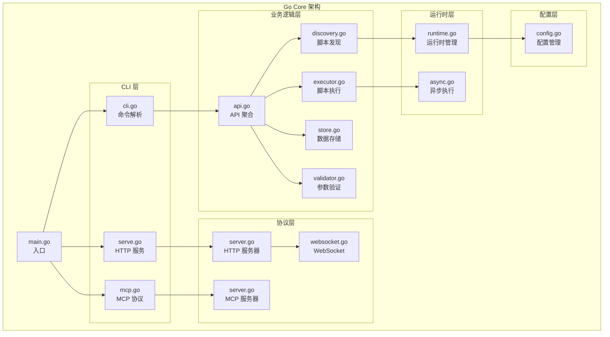
```mermaid
graph TB
    subgraph "Go Core 架构"
        M[main.go<br/>入口]
        
        subgraph "CLI 层"
            C1[cli.go<br/>命令解析]
            C2[serve.go<br/>HTTP 服务]
            C3[mcp.go<br/>MCP 协议]
        end
        
        subgraph "业务逻辑层"
            A1[api.go<br/>API 聚合]
            D1[discovery.go<br/>脚本发现]
            E1[executor.go<br/>脚本执行]
            S1[store.go<br/>数据存储]
            V1[validator.go<br/>参数验证]
        end
        
        subgraph "运行时层"
            R1[runtime.go<br/>运行时管理]
            R2[async.go<br/>异步执行]
        end
        
        subgraph "协议层"
            H1[server.go<br/>HTTP 服务器]
            H2[websocket.go<br/>WebSocket]
            M1[server.go<br/>MCP 服务器]
        end
        
        subgraph "配置层"
            CFG[config.go<br/>配置管理]
        end
        
        M --> C1
        M --> C2
        M --> C3
        C1 --> A1
        C2 --> H1
        C3 --> M1
        A1 --> D1
        A1 --> E1
        A1 --> S1
        A1 --> V1
        D1 --> R1
        E1 --> R2
        R1 --> CFG
        H1 --> H2
    end
```

#### 核心模块说明

**CLI 层**
- `cli.go`: 命令行参数解析和路由
- `serve.go`: HTTP API 服务启动
- `mcp.go`: Model Context Protocol 实现

**业务逻辑层**
- `api.go`: 统一 API 接口，聚合各模块功能
- `discovery.go`: 脚本发现和元数据加载
- `executor.go`: 脚本执行引擎
- `store.go`: 数据存储（JSON 文件）
- `validator.go`: 参数验证

**运行时层**
- `runtime.go`: 运行时环境管理
- `async.go`: 异步任务执行

**协议层**
- `server.go`: HTTP REST API
- `websocket.go`: 实时通信
- `server.go` (MCP): MCP 协议服务器

#### CLI 命令结构

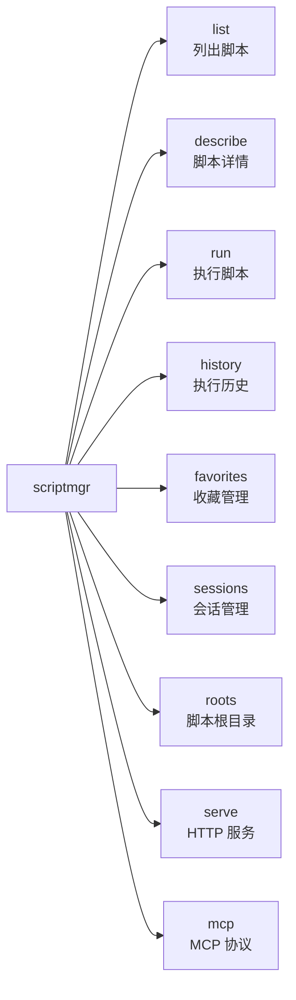
```mermaid
graph LR
    A[scriptmgr] --> B[list<br/>列出脚本]
    A --> C[describe<br/>脚本详情]
    A --> D[run<br/>执行脚本]
    A --> E[history<br/>执行历史]
    A --> F[favorites<br/>收藏管理]
    A --> G[sessions<br/>会话管理]
    A --> H[roots<br/>脚本根目录]
    A --> I[serve<br/>HTTP 服务]
    A --> J[mcp<br/>MCP 协议]
```

### 数据存储架构

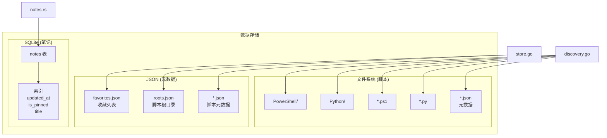
```mermaid
graph TB
    subgraph "数据存储"
        subgraph "SQLite (笔记)"
            S1[notes 表]
            S2[索引<br/>updated_at<br/>is_pinned<br/>title]
        end
        
        subgraph "JSON (元数据)"
            J1[favorites.json<br/>收藏列表]
            J2[roots.json<br/>脚本根目录]
            J3[*.json<br/>脚本元数据]
        end
        
        subgraph "文件系统 (脚本)"
            F1[PowerShell/]
            F2[Python/]
            F3[*.ps1]
            F4[*.py]
            F5[*.json<br/>元数据]
        end
    end
    
    R4[notes.rs] --> S1
    S1 --> S2
    G4[store.go] --> J1
    G4 --> J2
    G2[discovery.go] --> J3
    G2 --> F1
    G2 --> F2
    G2 --> F3
    G2 --> F4
    G2 --> F5
```

#### SQLite Schema

```sql
CREATE TABLE notes (
    id TEXT PRIMARY KEY,
    title TEXT NOT NULL DEFAULT '',
    content TEXT NOT NULL DEFAULT '',
    created_at TEXT NOT NULL,
    updated_at TEXT NOT NULL,
    is_pinned INTEGER NOT NULL DEFAULT 0
);

CREATE INDEX idx_notes_updated_at ON notes(updated_at DESC);
CREATE INDEX idx_notes_pinned ON notes(is_pinned DESC);
CREATE INDEX idx_notes_title ON notes(title);
```

#### JSON 存储格式

**favorites.json**
```json
{
  "ids": ["script-id-1", "script-id-2"],
  "updated_at": "2026-03-17T10:00:00Z"
}
```

**roots.json**
```json
{
  "roots": ["C:/Scripts/PowerShell", "C:/Scripts/Python"],
  "updated_at": "2026-03-17T10:00:00Z"
}
```

### 后端通信流程

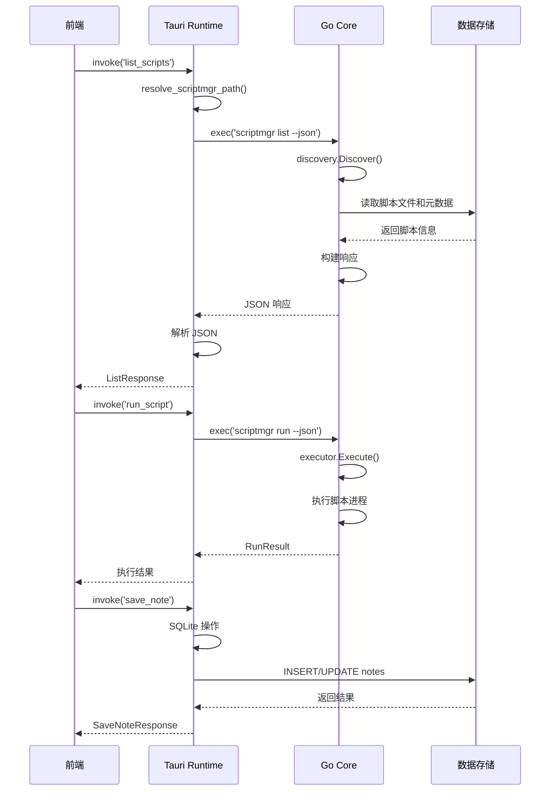
```mermaid
sequenceDiagram
    participant F as 前端
    participant T as Tauri Runtime
    participant G as Go Core
    participant DB as 数据存储
    
    F->>T: invoke('list_scripts')
    T->>T: resolve_scriptmgr_path()
    T->>G: exec('scriptmgr list --json')
    G->>G: discovery.Discover()
    G->>DB: 读取脚本文件和元数据
    DB-->>G: 返回脚本信息
    G->>G: 构建响应
    G-->>T: JSON 响应
    T->>T: 解析 JSON
    T-->>F: ListResponse
    
    F->>T: invoke('run_script')
    T->>G: exec('scriptmgr run --json')
    G->>G: executor.Execute()
    G->>G: 执行脚本进程
    G-->>T: RunResult
    T-->>F: 执行结果
    
    F->>T: invoke('save_note')
    T->>T: SQLite 操作
    T->>DB: INSERT/UPDATE notes
    DB-->>T: 返回结果
    T-->>F: SaveNoteResponse
```

### 后端错误处理

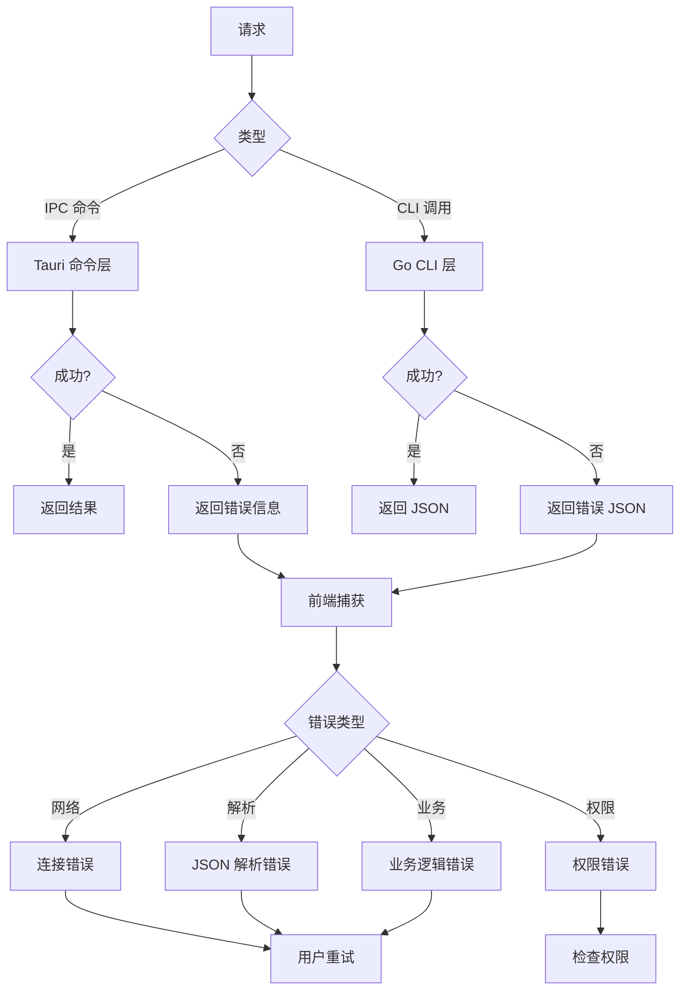
```mermaid
graph TB
    A[请求] --> B{类型}
    B -->|IPC 命令| C[Tauri 命令层]
    B -->|CLI 调用| D[Go CLI 层]
    
    C --> C1{成功?}
    C1 -->|是| C2[返回结果]
    C1 -->|否| C3[返回错误信息]
    
    D --> D1{成功?}
    D1 -->|是| D2[返回 JSON]
    D1 -->|否| D3[返回错误 JSON]
    
    C3 --> E[前端捕获]
    D3 --> E
    E --> F{错误类型}
    F -->|网络| G[连接错误]
    F -->|解析| H[JSON 解析错误]
    F -->|业务| I[业务逻辑错误]
    F -->|权限| J[权限错误]
    
    G --> K[用户重试]
    H --> K
    I --> K
    J --> L[检查权限]
```

---

## 前端发展规划

### 阶段一：核心功能完善 (当前阶段)

```mermaid
graph TB
    subgraph "阶段一：核心功能"
        A1[笔记管理<br/>✅ 已完成]
        A2[脚本执行<br/>✅ 已完成]
        A3[标签页管理<br/>✅ 已完成]
        A4[数据持久化<br/>✅ 已完成]
        A5[窗口管理<br/>✅ 已完成]
    end
    
    A1 --> A3
    A2 --> A4
    A3 --> A5
```

**已完成功能**：
- ✅ 笔记 CRUD 操作
- ✅ 笔记标签页管理
- ✅ 笔记搜索
- ✅ 笔记置顶
- ✅ 脚本列表和详情
- ✅ 脚本执行
- ✅ 窗口置顶
- ✅ 全局快捷键 (Ctrl+Alt+D)
- ✅ 数据持久化 (SQLite + localStorage)

### 阶段二：用户体验优化 (短期规划)

```mermaid
graph TB
    subgraph "阶段二：用户体验优化"
        B1[设置页面]
        B2[主题切换]
        B3[快捷键配置]
        B4[搜索功能]
        B5[历史记录]
        B6[收藏功能]
    end
    
    B1 --> B2
    B2 --> B3
    B3 --> B4
    B4 --> B5
    B5 --> B6
```

**计划功能**：

#### 1. 设置页面
- 应用配置界面
- 窗口设置（透明度、大小、位置）
- 编辑器设置（字体大小、行号、自动保存）
- 快捷键配置
- 主题设置

**实现要点**：
```typescript
// types/settings.ts
export interface AppSettings {
  window: {
    opacity: number;
    width: number;
    height: number;
    x: number;
    y: number;
  };
  editor: {
    fontSize: number;
    showLineNumbers: boolean;
    autoSave: boolean;
    autoSaveInterval: number;
  };
  shortcuts: {
    toggleWindow: string;
    newNote: string;
    search: string;
  };
  theme: 'light' | 'dark' | 'system';
}

// hooks/useSettings.ts
export function useSettings() {
  const [settings, setSettings] = useState<AppSettings>(defaultSettings);
  
  const updateSettings = useCallback((updates: Partial<AppSettings>) => {
    setSettings(prev => ({ ...prev, ...updates }));
    localStorage.setItem('settings', JSON.stringify(settings));
  }, []);
  
  return { settings, updateSettings };
}
```

#### 2. 主题切换
- 深色/浅色主题
- 跟随系统主题
- 自定义主题色

**实现要点**：
```typescript
// hooks/useTheme.ts
export function useTheme() {
  const [theme, setTheme] = useState<'light' | 'dark' | 'system'>('dark');
  
  useEffect(() => {
    if (theme === 'system') {
      const systemTheme = window.matchMedia('(prefers-color-scheme: dark)').matches 
        ? 'dark' 
        : 'light';
      document.documentElement.classList.toggle('dark', systemTheme === 'dark');
    } else {
      document.documentElement.classList.toggle('dark', theme === 'dark');
    }
  }, [theme]);
  
  return { theme, setTheme };
}
```

#### 3. 快捷键配置
- 自定义快捷键
- 快捷键冲突检测
- 快捷键提示

**实现要点**：
```typescript
// hooks/useShortcuts.ts
export function useShortcuts() {
  const [shortcuts, setShortcuts] = useState<Shortcuts>(defaultShortcuts);
  
  const registerShortcut = useCallback((action: string, key: string) => {
    // 注册快捷键逻辑
  }, []);
  
  return { shortcuts, registerShortcut };
}
```

#### 4. 搜索功能
- 笔记全文搜索
- 脚本搜索
- 集成 Everything 搜索（可选）
- 搜索历史

**实现要点**：
```typescript
// hooks/useSearch.ts
export function useSearch() {
  const [query, setQuery] = useState('');
  const [results, setResults] = useState<SearchResult[]>([]);
  const [history, setHistory] = useState<string[]>([]);
  
  const search = useCallback(async (q: string) => {
    const notes = await searchNotes(q);
    const scripts = await listScripts({ search: q });
    setResults([
      ...notes.map(n => ({ type: 'note', ...n })),
      ...scripts.map(s => ({ type: 'script', ...s }))
    ]);
    setHistory(prev => [q, ...prev.filter(h => h !== q)].slice(0, 10));
  }, []);
  
  return { query, setQuery, results, history, search };
}
```

#### 5. 历史记录
- 脚本执行历史
- 笔记编辑历史
- 历史记录查看
- 历史记录清理

**实现要点**：
```typescript
// hooks/useHistory.ts
export function useHistory() {
  const [history, setHistory] = useState<HistoryEntry[]>([]);
  
  const loadHistory = useCallback(async () => {
    // 从 Go Core 加载历史
    const response = await invoke<HistoryResponse>('get_history');
    setHistory(response.entries);
  }, []);
  
  const clearHistory = useCallback(async () => {
    await invoke('clear_history');
    setHistory([]);
  }, []);
  
  return { history, loadHistory, clearHistory };
}
```

#### 6. 收藏功能
- 脚本收藏
- 笔记收藏
- 收藏夹管理
- 收藏同步

**实现要点**：
```typescript
// hooks/useFavorites.ts
export function useFavorites() {
  const [favorites, setFavorites] = useState<string[]>([]);
  
  const toggleFavorite = useCallback(async (id: string) => {
    const isFavorite = favorites.includes(id);
    if (isFavorite) {
      setFavorites(prev => prev.filter(f => f !== id));
      await invoke('remove_favorite', { id });
    } else {
      setFavorites(prev => [...prev, id]);
      await invoke('add_favorite', { id });
    }
  }, [favorites]);
  
  return { favorites, toggleFavorite };
}
```

### 阶段三：高级功能 (中期规划)

```mermaid
graph TB
    subgraph "阶段三：高级功能"
        C1[实时输出]
        C2[任务队列]
        C3[定时任务]
        C4[脚本模板]
        C5[插件系统]
        C6[数据同步]
    end
    
    C1 --> C2
    C2 --> C3
    C3 --> C4
    C4 --> C5
    C5 --> C6
```

**计划功能**：

#### 1. 实时输出
- WebSocket 实时输出
- 输出高亮
- 输出过滤
- 输出导出

**实现要点**：
```typescript
// hooks/useRealtimeOutput.ts
export function useRealtimeOutput(taskId: string) {
  const [output, setOutput] = useState('');
  const [isComplete, setIsComplete] = useState(false);
  
  useEffect(() => {
    const ws = new WebSocket(`ws://localhost:3000/output/${taskId}`);
    
    ws.onmessage = (event) => {
      const data = JSON.parse(event.data);
      if (data.type === 'output') {
        setOutput(prev => prev + data.content);
      } else if (data.type === 'complete') {
        setIsComplete(true);
        ws.close();
      }
    };
    
    return () => ws.close();
  }, [taskId]);
  
  return { output, isComplete };
}
```

#### 2. 任务队列
- 后台任务队列
- 任务优先级
- 任务取消
- 任务重试

**实现要点**：
```typescript
// hooks/useTaskQueue.ts
export function useTaskQueue() {
  const [queue, setQueue] = useState<Task[]>([]);
  const [running, setRunning] = useState<Task | null>(null);
  
  const enqueue = useCallback((task: Task) => {
    setQueue(prev => [...prev, task]);
  }, []);
  
  const dequeue = useCallback(() => {
    setQueue(prev => {
      const [first, ...rest] = prev;
      setRunning(first);
      return rest;
    });
  }, []);
  
  return { queue, running, enqueue, dequeue };
}
```

#### 3. 定时任务
- Cron 表达式
- 定时执行脚本
- 任务调度
- 执行日志

#### 4. 脚本模板
- 模板创建
- 模板变量
- 模板继承
- 模板市场

#### 5. 插件系统
- 插件加载
- 插件 API
- 插件市场
- 插件管理

#### 6. 数据同步
- 云端同步
- 多设备同步
- 冲突解决
- 数据备份

### 阶段四：企业功能 (长期规划)

```mermaid
graph TB
    subgraph "阶段四：企业功能"
        D1[用户管理]
        D2[权限控制]
        D3[审计日志]
        D4[团队协作]
        D5[API 集成]
        D6[监控告警]
    end
    
    D1 --> D2
    D2 --> D3
    D3 --> D4
    D4 --> D5
    D5 --> D6
```

**计划功能**：

#### 1. 用户管理
- 用户注册/登录
- 用户资料
- 用户设置
- 用户权限

#### 2. 权限控制
- 角色管理
- 权限分配
- 脚本权限
- 操作审计

#### 3. 审计日志
- 操作日志
- 访问日志
- 异常日志
- 日志分析

#### 4. 团队协作
- 团队创建
- 成员管理
- 脚本共享
- 协作编辑

#### 5. API 集成
- REST API
- Webhook
- 第三方集成
- API 文档

#### 6. 监控告警
- 性能监控
- 错误监控
- 告警规则
- 通知推送

### 技术债务清理

```mermaid
graph TB
    subgraph "技术债务"
        T1[类型完善]
        T2[错误处理]
        T3[测试覆盖]
        T4[性能优化]
        T5[文档完善]
        T6[代码重构]
    end
    
    T1 --> T2
    T2 --> T3
    T3 --> T4
    T4 --> T5
    T5 --> T6
```

**清理计划**：

1. **类型完善**
   - 补充缺失的类型定义
   - 添加严格的类型检查
   - 消除 any 类型

2. **错误处理**
   - 统一错误处理机制
   - 添加错误边界
   - 完善错误提示

3. **测试覆盖**
   - 单元测试
   - 集成测试
   - E2E 测试

4. **性能优化**
   - 代码分割
   - 懒加载
   - 缓存优化

5. **文档完善**
   - API 文档
   - 组件文档
   - 架构文档

6. **代码重构**
   - 提取公共逻辑
   - 优化代码结构
   - 消除重复代码

### 开发优先级

```mermaid
graph LR
    A[高优先级] --> B[中优先级]
    B --> C[低优先级]
    
    A --> A1[设置页面]
    A --> A2[主题切换]
    A --> A3[搜索功能]
    
    B --> B1[快捷键配置]
    B --> B2[历史记录]
    B --> B3[收藏功能]
    
    C --> C1[实时输出]
    C --> C2[任务队列]
    C --> C3[定时任务]
```

**优先级说明**：

- **高优先级**：核心用户体验功能，影响日常使用
- **中优先级**：增强功能，提升使用效率
- **低优先级**：高级功能，特定场景使用

### 技术栈演进

```mermaid
graph TB
    subgraph "当前技术栈"
        A1[React 18]
        A2[TypeScript 5]
        A3[Tauri 2]
        A4[Vite 5]
        A5[Tailwind CSS 3]
    end
    
    subgraph "计划引入"
        B1[Zustand<br/>状态管理]
        B2[React Query<br/>数据获取]
        B3[Monaco Editor<br/>代码编辑]
        B4[Zod<br/>数据验证]
        B5[Vitest<br/>测试框架]
    end
    
    A1 --> B1
    A2 --> B4
    A3 --> B2
    A4 --> B5
    A5 --> B3
```

**技术栈演进计划**：

1. **Zustand**：轻量级状态管理，替代部分 useState
2. **React Query**：数据获取和缓存，优化 IPC 调用
3. **Monaco Editor**：强大的代码编辑器，支持语法高亮
4. **Zod**：运行时数据验证，增强类型安全
5. **Vitest**：单元测试框架，提升代码质量

---

## 技术栈

### 前端技术栈

| 技术 | 版本 | 用途 |
|------|------|------|
| React | 18+ | UI 框架 |
| TypeScript | 5+ | 类型系统 |
| Tauri | 2+ | 桌面应用框架 |
| Vite | 5+ | 构建工具 |
| Tailwind CSS | 3+ | 样式框架 |

### 后端技术栈

| 技术 | 版本 | 用途 |
|------|------|------|
| Rust | 1.70+ | Tauri Runtime |
| Go | 1.21+ | 核心业务逻辑 |
| SQLite | 3+ | 笔记数据库 |
| Tauri Plugins | 2+ | 插件系统 |

### 计划引入技术栈

| 技术 | 用途 | 引入阶段 |
|------|------|----------|
| Zustand | 状态管理 | 阶段二 |
| React Query | 数据获取和缓存 | 阶段二 |
| Monaco Editor | 代码编辑器 | 阶段三 |
| Zod | 数据验证 | 阶段二 |
| Vitest | 测试框架 | 阶段二 |

## 开发规范

### 命名规范

- **组件**：PascalCase (e.g., NoteEditor)
- **Hook**：camelCase，use 前缀 (e.g., useNotes)
- **函数**：camelCase (e.g., handleTabClose)
- **类型/接口**：PascalCase (e.g., Note, Tab)
- **常量**：UPPER_SNAKE_CASE (e.g., PAGE_STORAGE_KEY)

### 文件组织

- 按功能模块组织文件
- 相关类型定义与实现放在一起
- IPC 封装统一放在 lib/tauri
- 类型定义统一放在 types

### 代码风格

- 使用 TypeScript 严格模式
- 组件使用函数式组件 + Hooks
- 优先使用函数式编程
- 避免副作用，保持纯函数

## 开发规范

### 命名规范

- **组件**：PascalCase (e.g., NoteEditor)
- **Hook**：camelCase，use 前缀 (e.g., useNotes)
- **函数**：camelCase (e.g., handleTabClose)
- **类型/接口**：PascalCase (e.g., Note, Tab)
- **常量**：UPPER_SNAKE_CASE (e.g., PAGE_STORAGE_KEY)

### 文件组织

- 按功能模块组织文件
- 相关类型定义与实现放在一起
- IPC 封装统一放在 lib/tauri
- 类型定义统一放在 types

### 代码风格

- 使用 TypeScript 严格模式
- 组件使用函数式组件 + Hooks
- 优先使用函数式编程
- 避免副作用，保持纯函数

## 总结

Deskflow 采用清晰的分层架构设计，前端使用 React + TypeScript，后端由 Tauri Rust Runtime 和 Go Core 组成，实现了笔记管理和脚本执行两大核心功能。

### 架构优势

**前端优势**：
- 清晰的分层架构
- 类型安全的 TypeScript
- 高效的状态管理
- 良好的错误处理
- 优秀的性能优化
- 良好的扩展性

**后端优势**：
- Rust 提供高性能和安全性
- Go 提供简洁的业务逻辑
- SQLite 提供可靠的数据存储
- 插件系统提供扩展能力
- CLI 协议提供灵活性
- MCP 协议支持 AI 集成

### 设计原则

- **单一职责**：每个模块只负责一个功能
- **关注点分离**：前后端职责明确
- **类型安全**：全栈类型安全
- **性能优先**：优化关键路径
- **可扩展性**：预留扩展点
- **可维护性**：清晰的代码结构

### 发展规划

**阶段一**：核心功能完善 ✅
- 笔记管理
- 脚本执行
- 标签页管理
- 数据持久化
- 窗口管理

**阶段二**：用户体验优化（短期）
- 设置页面
- 主题切换
- 快捷键配置
- 搜索功能
- 历史记录
- 收藏功能

**阶段三**：高级功能（中期）
- 实时输出
- 任务队列
- 定时任务
- 脚本模板
- 插件系统
- 数据同步

**阶段四**：企业功能（长期）
- 用户管理
- 权限控制
- 审计日志
- 团队协作
- API 集成
- 监控告警

### 技术演进

- 引入 Zustand 进行状态管理
- 引入 React Query 优化数据获取
- 引入 Monaco Editor 提升编辑体验
- 引入 Zod 增强数据验证
- 引入 Vitest 提升测试覆盖

Deskflow 架构为后续功能开发提供了坚实的基础，具有良好的扩展性和可维护性。
